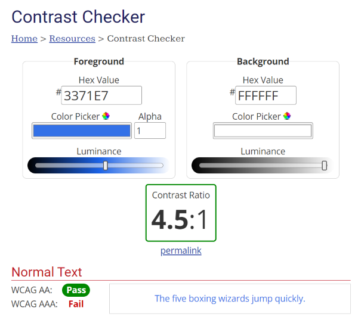

# Ensure that there is sufficient contrast between colors used in your data visualization or dashboard. 

Check that your content has enough color contrast between individual elements and against the background. Use a contrast checker like the WebAIM Contrast Checker to find the contrast ratio of the colors used in your content. 

\
*Use a tool like the WebAIM Contrast Checker to make sure there is enough contrast between colors.*

To use the WebAIM Contrast Checker, enter a foreground and a background color in RGB hexadecimal format (e.g. #FD3 or #F7DA39) or choose a color using a color picker to extract the color value from any page element. The contrast checker will tell you if your color combination passes or fails the Web Accessibility Initiative’s Web Content Accessibility Guidelines (W3C WCAG 2.1) requirements.

W3C WCAG 2.1 recommends at least a 3:1 contrast ratio for non-text elements and large text and at least 4.5:1 for smaller text against its background. 
