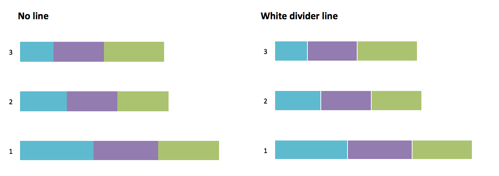

# Use white space.

When information is too densely packed, your data visualization can feel overwhelming and unreadable. You can make your visualization clearer by leaving a gap between sections of a chart. This can also supplement accessible color choices by helping users distinguish the difference between colors that identify separate sections.

\
*Example of an effective use of white space from Amy Cesal’s [Accessible data viz is better data viz](https://www.storytellingwithdata.com/blog/2018/6/26/accessible-data-viz-is-better-data-viz){:target="_blank"}.*