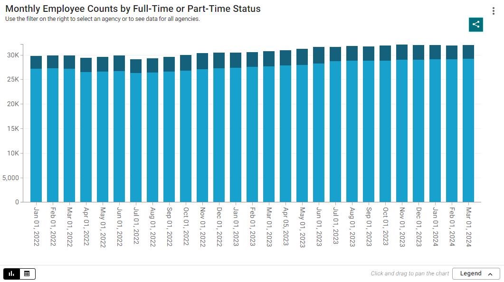
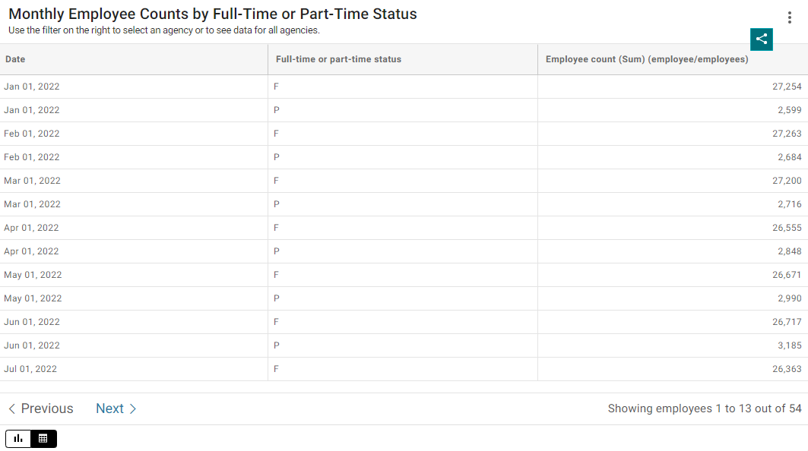

# Provide an accessible table format.

Make your data available in an accessible table format to provide an alternate format for consuming the data for people who may find your data visualization inaccessible (for example, some non-visual users may find a table to be easier to navigate with a screen reader.)  

If you use the data visualization tool on the CT Open Data Portal, the visualization will automatically be available as a chart and a table. Using this data visualization tool is an easy way to ensure your data is available in an accessible table format.

*Column chart created in the Open Data Portal to illustrate the option to toggle between chart and table.*

If you use a data visualization tool that does not automatically generate a table (e.g. Microsoft Power BI, Tableau, Datawrapper, etc.), you will need to create a table yourself and place it with your data visualization. 

When creating a table, make sure to format the table to make the data easy for people to understand. A few guidelines for formatting tables include: 

* Name your columns clearly 
* Sort the table by importance to your audience 
* Structure the table intuitively 
* Avoid blank cells, which can be unclear and confusing 

\
*[Example of a dashboard from Data SF](https://datasf.gitbook.io/public-data-visualization-guide/gallery-of-dashboard-transformations){:target="_blank"} built with Power BI that includes a chart and an accessible data table.*