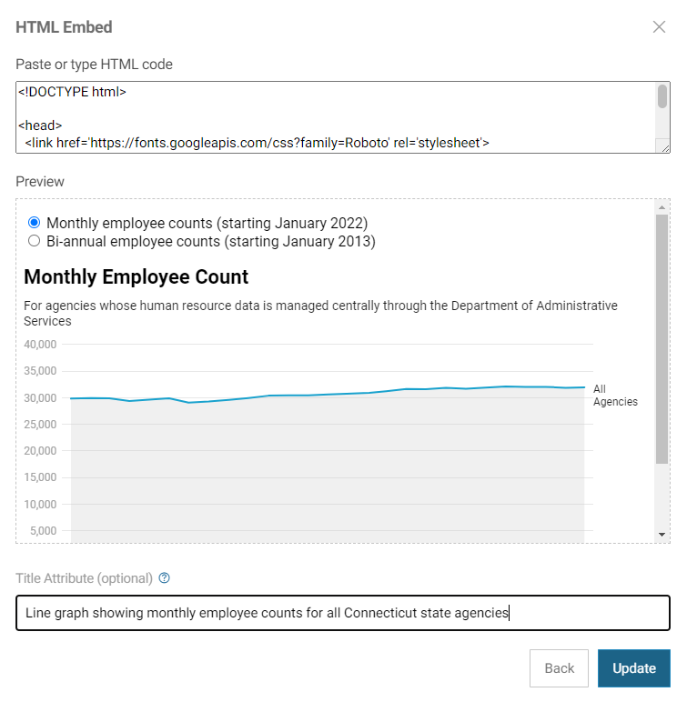
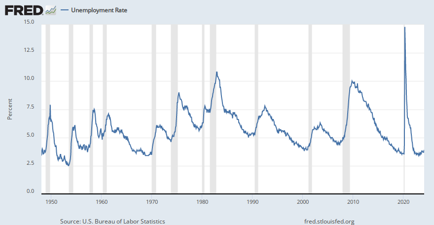

# Use alternative text (alt text) to describe all non-decorative visuals.

Alternative text (alt text) is a textual substitute for non-text content in web pages. According to [WebAIM](https://webaim.org/techniques/alttext/){:target="_blank"}, alt text serves several functions: 

* Screen readers, the assistive technology used by people who are visually impaired, read alt text out loud in place of people seeing the image. 
* If an image fails to load or the user has blocked images, the browser will present the alt text visually in place of the image. 
* Search engines use alt text as part of their assessment of a website and its content.

Alt text can be added within the alt attribute of the  element or in visible body text near the image; if the text can’t be presented succinctly, alt text can be presented on a separate page linked from the image or a text link near the mage. 

In the CT Open Data Portal, you can add alt text to any embedded content in a data story, as pictured below. 

\
*Screenshot of html embed content in a data story on the Open Data Portal*

WebAIM recommends that the alt attribute should: 

* Be an accurate and equivalent representation of the content 
* Be succinct—typically only a few words are necessary, although in some cases a sentence or two may be appropriate 
* Not be redundant 
* Not include phrases like “image of…” or “graphic of…” because screen readers will already announce “graphic” along with the alt text. 

The table below shows four options for alt text for the line graph on the left. For more guidance on writing alt text, see "Writing Alt Text to Communicate the Meaning in Data Visualizations” in the Urban Institute’s [Do No Harm Guide: Centering Accessibility in Data Visualization](https://www.urban.org/research/publication/do-no-harm-guide-centering-accessibility-data-visualization){:target="_blank"}.

\
*Example alt text from "Writing Alt Text to Communicate the Meaning in Data Visualizations” in the Urban Institute’s [Do No Harm Guide: Centering Accessibility in Data Visualization](https://www.urban.org/research/publication/do-no-harm-guide-centering-accessibility-data-visualization){:target="_blank"}*

| ------------------------------------------------------------------------------------------------------------------ | 
|This graph contains a blue line showing monthly unemployment rates in the US and gray vertical bars showing recessions. The source of the data is the Bureau of Labor Statistics and the National Bureau of Economic Research.| 
The x-axis shows the month and year from January 1950 to June 2022. The y-axis shows the unemployment rate with a range of 0 to 16 percent. The bars extend along the entire vertical area and correspond to the 11 recessions since 1950. The unemployment rose from 4.4 percent in March 2020 to 14.7 percent in April 2020, a 10.3 percentage point change. The second-highest change was a 1.3 percentage-point change between September and October 1949. |
The unemployment rate line typically slopes upward during recessions, though not always, and it starts to move upward before recessions begin. The longest gap between recessions was from July 2009 to January 2020, a total of 120 months. |
The largest month-over-month increase in the unemployment rate during this period occurred during the most recent recession in spring 2020, resulting from the COVID-19 pandemic. |