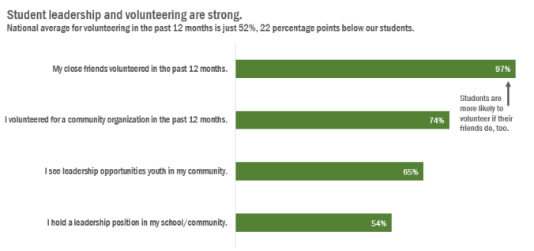

# Use meaningful labels and titles. 

Use clear labels and titles to decrease the cognitive load of understanding your data visualization. Two steps you can take to improving the clarity of your labels and titles (from Amy Cesal’s [Accessible data viz is better data viz](https://www.storytellingwithdata.com/blog/2018/6/26/accessible-data-viz-is-better-data-viz){:target="_blank"}) are:

* Use a “takeaway title” for your chart that helps the user understand the graph’s main takeaway point. 
* Use direct labels rather than legends where possible. By directly labeling your data you can reduce the cognitive burden on users and make it more accessible to colorblind or visually impaired users who may have a hard time matching colors between the plot and legend. 

\
*Example of bar chart with a meaningful title and direct labels from Stephanie Evergreen’s [How to Rock the Text in Your Data Visualization](https://stephanieevergreen.com/how-to-rock-the-text-in-your-data-visualization/){:target="_blank"}.*

